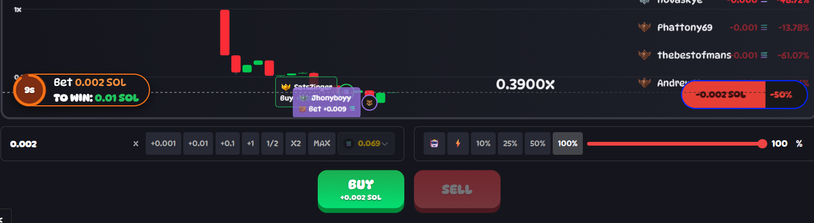

# Side Bet UI Walkthrough - Visual Guide

## Overview
This walkthrough demonstrates a complete game cycle showing side bet mechanics in action. The screenshots focus on the side bet interface elements and show real gameplay from presale through rug event[...]

**Game Summary:**
- **Total Side Bets Placed:** 2
- **Side Bet 1:** 0.002 SOL (Presale) → **LOSS**
- **Side Bet 2:** 0.002 SOL (Tick ~50) → **WIN**
- **Final Result:** +150% net profit on side bets

---

## Screenshot 1: Initial Interface Setup


**Interface Elements:**
- **Position Size Toggle:** Shows 0.002 SOL selected
- **Side Bet Button:** Yellow button (top left) displaying potential winnings
- **Auto-calculation:** Button automatically shows "Win 0.01" based on current position size
- **Multiplier Logic:** 0.002 SOL × 5 = 0.01 SOL potential payout

**Key Insight:** The side bet button dynamically updates to show potential winnings based on whatever amount is currently in the position size toggle.

---

## Screenshot 2: Presale Side Bet Placement

  


**Game State:**
- **Phase:** Presale (4.70 seconds remaining)
- **Side Bet Status:** Active presale side bet for 0.002 SOL
- **Coverage:** Will cover ticks 0-39 when game goes live
- **Countdown:** Game will begin shortly

**Strategy Note:** Presale side bets guarantee coverage of the critical early-game period where rugs are most likely to occur.

---

## Screenshot 3: First Side Bet Loss


**Game State:**
- **Current Tick:** ~50+ (game still active)
- **Side Bet 1 Result:** LOST (-0.002 SOL)
- **Running P&L:** -0.002 SOL
- **Game Status:** Still active, no rug occurred in first 40 ticks

**UI Feedback:** Interface clearly shows the loss and updates running P&L immediately.

---

## Screenshot 4: Second Side Bet Placement



**Game State:**
- **Current Tick:** ~50
- **New Side Bet:** 0.002 SOL placed for ticks 50-89
- **Cumulative Risk:** 0.004 SOL total wagered
- **Potential Gross:** 0.01 SOL if this bet wins
- **Potential Net:** 0.006 SOL (0.01 win - 0.004 wagered)

**Strategy Context:** Player doubles down after first loss, betting that rug will occur in the next 40-tick window.

---

## Screenshot 5: Winning Side Bet Resolution


**Final Results:**
- **Rug Tick:** 82 (within second side bet window of 50-89)
- **Side Bet 2:** WIN (+0.01 SOL gross, +0.008 SOL net)
- **Final P&L:** +0.006 SOL net profit
- **Return:** 150% net profit on total wagered amount

**Calculation Breakdown:**
```
Total Wagered: 0.004 SOL (2 × 0.002)
Total Won: 0.01 SOL (5:1 payout on winning bet)
Net Profit: 0.01 - 0.004 = 0.006 SOL
Return Rate: (0.006 / 0.004) × 100 = 150%
```

---

## Key UI/UX Observations

### 1. Dynamic Button Updates
- Side bet button shows real-time potential winnings
- Amount automatically syncs with position size toggle
- Clear visual feedback for active bets

### 2. Immediate Financial Settlement
- SOL debited instantly on placement
- Winnings credited immediately at rug
- Running P&L tracked throughout game

### 3. Multiple Bet Strategy
- Players can place sequential side bets
- Each bet follows same 40-tick window rule
- Cumulative P&L clearly displayed

### 4. Visual Status Indicators
- Clear win/loss feedback
- Active bet status during gameplay
- Countdown timers for presale phase

---

## Strategic Takeaways

**Risk Management:**
- First bet (presale) covers highest probability window but lost
- Second bet (mid-game) had lower probability but won
- Multiple attempts increased overall success chance

**Timing Strategy:**
- Presale betting ensures early coverage
- Mid-game betting can capitalize on extended rounds
- Sequential betting allows multiple opportunities per game

**Financial Results:**
- Despite 50% bet failure rate, achieved 150% net return
- Single winning bet overcame previous loss
- Demonstrates both risk and reward potential of side bet system

---

*This walkthrough demonstrates typical side bet gameplay patterns and UI interactions. Results will vary based on game length and timing decisions.*
